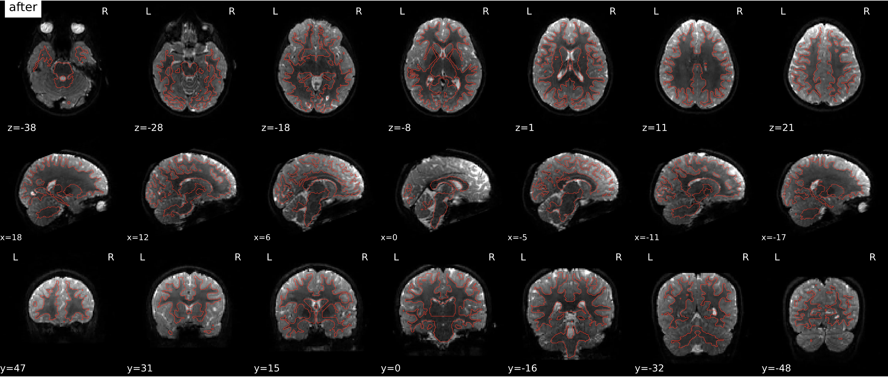

# QSIPrep_Visual_QA_Guide
`last update: 08/18/2024`
This is a guide for reviewing QSIPrep's dmri preproc visual quality assessment report html.

First, here is the [official documentation](https://qsiprep.readthedocs.io/en/latest/) for QSIPrep, and here is the nature method [paper](https://www.nature.com/articles/s41592-021-01185-5) that describe the dmri data processing pipeline.

Shortly, qsiprep configures pipelines for processing diffusion-weighted MRI (dMRI) data. The main features of this software are
- A BIDS-app approach to preprocessing diffusion MRI data.
- Automatical preprocessing pipelines that correctly group, distortion correct, motion correct, denoise, coregister and resample your scans, producing visual reports and QC metrics.
- A system for running state-of-the-art reconstruction pipelines that include algorithms from Dipy, MRTrix, DSI Studio and others.
- A novel motion correction algorithm that works on DSI and random q-space sampling schemes

The output of preprocessing from QSIPrep is structured as:
```
Result_dir
├── dataset_description.json
├── dwiqc.json # Quality control json file
├── sub-01.html # Visual quality assessment reports per subject
├── sub-02.html
└── logs
└── sub-01
     ├──  anat  #preproced anat data, cross session
     ├──  figures #preproc figure in the html
     ├──  log
     ├──  ses-HBNsiteRU #counfounds transformation matrix, & preproced dwi
     │   └── anat
     │   └── dwi
 └── sub-02
 ```

Here the goal of this repo is to show **a figure by figure introduction of how to read the html visual quality assessment report**. 

Note that the visual report elements included are just the default options, other optional results are pending. pls stay in tuned!

The Full illustration is seperated into these parts:
- step 0, error inspectation
- step 1, Anatomical Processing
- step 2, Denosing
- step 3, Diffusion Processing
- step 4, Additional QC Tool-dmriprep viewer

## Step 0, error inspectation
Before you start any further assesment, click on the **Error tab** and see if there is any error reported and it says "No errors to report!"

## Step 1, Anatomical
### Brain mask and tissue segmentation of the T1w


QSIprep uses anatomical images (T1w or T2w) for robust brain extraction with SynthStrip from FreeSurfer. The boundaries between tissues are highlighted so it can be verified that the segmentation is precise and no gross errors. 

- **Brain mask**: make sure the `red line` is going around the brain and does not stray into the dura or cut off pieces of the brain, and voxels outside the brain were successfully excluded from the brain mask. 
- **Segmentation**: make sure the `blue line` follows the boundary between the white matter and the gray matter and isn't cutting off pieces of the white matter

### T1 to MNI registration


QSIprep also normalizes the anatomical image, whichprovides a registration matrix used to normalize the co-registered dMRI image. 
Ensuring that `moving` images (registered) match the orientation of `fixed` images (original T1w), and the anatomical structures are structurally well-aligned. 

## Step 2, Denoising
### DWI denoising


The `contour map` of the noise image is calculated by MP-PCA patch, which shows the average magnitude of the noise that it’s subtracting. The `after` image is the result of the `raw` image subtracting the noise.
The noise image should not have anatomical features in it, such as ventricles. 

### DWI Bias correction


The raw image and its intensity normalized afterimage are plotted. The bias is plotted as a contour map. 
- The `raw` image: low/high-b might have higher intensity near the coil, and lower intensity at the middle of the brain.
- The `denoised` image should have a more normalized image across the slices.

## Step 3, Diffusion
### b=0 Reference Image


This plot shows the b=0 template and final mask output. 
- The T1 and signal intersection mask is the `blue line`
- their xor is `red line`
- the entire mask is plotted in `cyan line`.
   
You should see a good alignment between the `before` and `after` image using the mask.

### DWI Sampling Scheme


As a part of preprocessing, gradients should be rotated. This animation can be used to verify that the original gradients (on the left) have indeed been rotated and that the new scheme (on the right) follows the appropriate direction along the main axes. 

### Susceptibility distortion correction (TOPUP)



The above plot shows a diffusion-weighted image before and after correcting for susceptibility distortion. The image `before` the correction still exhibits this distortion. The `after` image should be anatomically correct,  especially in the frontal area. 

The `blue contour line` shows the white matter and gray matter interface from the tissue segmentation based on the T1w.

There are different approaches to correct for this distortion. QSIprep offers three possibilities. When two or more echo-planar images (EPI) with opposing phase-encoding polarities are available, QSIprep can use TOPUP from FSL along with eddy current and head motion correction. 


### b=0 to anatomical reference registration


The plot shows the results of the registration from the original diffusion space of the b=0 volume to the anatomical space. 

`Fixed` image refers to the image that was used as reference (T1w) and `moving` refers to the image that was transformed (b=0). We should see a good alignment between two figures. 
fix (T1w) and moving (b=0) should have different parts of the brain gaining more contrast.

### DWI Summary


Carpet plot is organized as volume by time, they plot the cross-correlation or standard deviation value between each raw slice and the HMC model signal resampled into that slice.

Eddy shows the carpet plot of what is the **standard deviation** of the slice at a certain image number. **Slices with more outliers appear more yellow, while fewer outliers are more blue**. The exemplar plot shows really great quality, most volume in the most of the time points all exhibit high quality.

## step 4, Additional QC Tool-dmriprep viewer
QSIPrep produces dwiqc.json file at the output directory across subject and sessions.
```
Result_dir
├── dataset_description.json
├── dwiqc.json # Quality control json file
├── sub-01.html # Visual quality assessment reports per subject
├── sub-02.html
└── logs
└── sub-01
└── sub-01
```
This dwiqc.json file can be used by an interactive QC tool with [dmriprep viewer](https://www.nipreps.org/dmriprep-viewer/#/), and this is their [repo](https://github.com/nipreps/dmriprep-viewer). You just need to put the directory to the dwiqc.json. 


The benefit of using dmriprep viewer is that, you could view at each participant level: the motion and distortion correction at all volume at each time point, Brain mask computed on T1w and mapped to B0, even Color FA mapped on B0. 


You could also rate the subject as pass/not pass for them to be included into the future analysis and download the ratings.

There is an [youtube walkthrough](https://www.youtube.com/watch?v=SQ0v-O-e5b8) that shows how to use this. 

## Acknowlegdement* 
Appreciate the [fmriprep_qa_guide](https://github.com/transatlantic-comppsych/fmriprep_qa_guide/tree/master) that really helped me during my exploration of fmriprep visual assessment report. This inspired me to write down this documentation of QSIPrep in case someone in the future have the same questions I met. The contributors are [Dylan Nielson](https://github.com/Shotgunosine), [Isil Bilgin](https://github.com/complexbrains), and [Chris Camp](https://github.com/chrisclaycamp).

Additionally, the exploration of QSIPrep was done during the summer school [NeuroHack Academy](https://neurohackademy.org/), thanks for the hosters at U Washington and other Uni-s. 

I would also love to say thank you to my group members during neurohack, I had a incredible time working with them. **We developped [a beginner guide on diffusion image processing](https://github.com/NeuroHackademy2024/diffusion-mri), include a full guide on how to understand diffusion imaging, how to implement QSIPrep, etc**. Thank you: 
- [Allesandra Iadipaolo](https://github.com/aiadipaolo)
- [Gabriela Ojeda  Valencia](https://github.com/Ojvagab)
- [Claudia Tato Fernández](https://github.com/TatoCl)
- [Lya K. Paas](https://github.com/lilikapa)
- [Elle Murata](https://github.com/emucsb)
- [Lupita Yáñez Ramos](https://github.com/Lupitayanez)
- [Luis A.](https://github.com/LuisA00)

Welcome everyone to take a look at the [repo](https://github.com/NeuroHackademy2024/diffusion-mri)!
